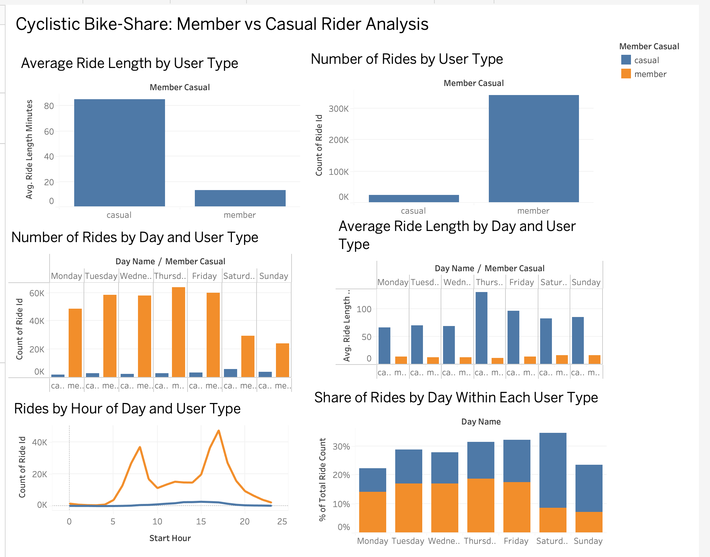

# Cyclistic Bike-Share Data Analysis

## Project Overview

This project analyzes Cyclistic bike-share usage to understand how annual members and casual riders use bikes differently.

The analysis uses Q1 2019 and Q1 2020 trip data and focuses on ride duration, ride volume, day-of-week patterns, and hourly riding patterns.

## Business Task

Cyclistic wants to increase the number of annual memberships.

The goal of this analysis is to identify differences between annual members and casual riders and use those differences to develop recommendations for converting casual riders into annual members.

## Data

The analysis uses two datasets:

- Divvy Trips 2019 Q1
- Divvy Trips 2020 Q1

The final cleaned dataset contains 791,746 rides.

## Tools Used

- Python
- Pandas
- Tableau
- Google Slides

## Data Preparation

The data was prepared using Python and Pandas.

The main steps included:

- Renaming columns to create a consistent structure
- Standardizing user types as member and casual
- Converting date and time fields to datetime format
- Calculating ride length
- Removing rides with zero or negative duration
- Creating day-of-week and start-hour fields
- Combining the two datasets
- Checking for missing values and duplicates

## Analysis

The analysis compares members and casual riders based on:

1. Average ride length
2. Number of rides
3. Day-of-week riding patterns
4. Hour-of-day riding patterns

## Key Findings

- Casual riders have a much longer average ride duration than members.
- Members account for more rides overall in the analyzed dataset.
- Casual riders have a larger share of rides on weekends.
- Member rides show stronger peak-hour patterns, particularly around morning and evening commuting periods.

## Recommendations

1. Promote membership during peak commuter hours.
2. Target casual riders with weekend-focused membership promotions.
3. Highlight membership value for casual riders who take longer trips.

## Project Deliverables

- Python/Pandas data analysis
- Tableau visualizations and dashboard
- Google Slides presentation
